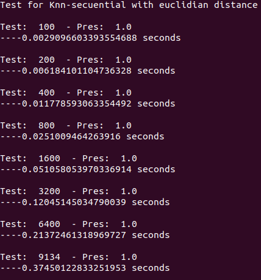
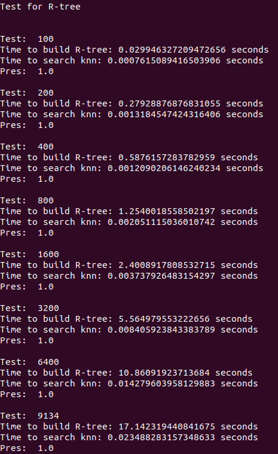

# Práctica Calificada 4

## Extracción de Características

Para la extracción de características usamos la librería face_recognition, usamos una colección de imágenes brindada por la universidad de Massachusetts con más de 13 mil imágenes. De dicha colección eliminamos las personas que solo tenían una imagen asociada y las imágenes con caras que no podían ser detectadas por face_recognition, quedandonos con 9 mil imágenes.

## Indexación

En el archivo [write.py](write.py) extrameos las características de los rostros de las fotos y las almacenamos en un archivo, para leer e imprimir dichas características podemos emplear [read.py](read.py). De esta manera no tenemos que buscar las características todo el tiempo ya que toma aproximadamente 20 minutos leer mil imágenes.

## Búsqueda

En [recognition.py](recognition.py) tenemos las siguientes funciones para realizar la búsqueda de los k veciinos más cercanos usando la distancia euclidiana y la distancia manhattan.

- **euclidian_distance**: Dados dos vectores de características, halla la distancia Euclidiana entre estos dos.
- **manhattan_distance**: Dados dos vectores de características, halla la distancia Manhattan entre estos dos.
- **knn_search_e**: Recibe un objeto a buscar, este objeto debe tener atributos "encode" (vector de características) y "person" (nombre de la persona), un array de una colección con el mismo tipo de objeto y un número k que corresponde al número de vecinos que se desea obtener. Se recorren todos los objetos en el array, se halla la distancia euclidiana entre uno de los objetos y el objeto a buscar, en una cola con prioridad almacenamos el objeto y la distancia hallada, finalmente retornamos los k primeros elementos y la precisión.
- **knn_search_m**: Recibe un objeto a buscar, este objeto debe tener atributos "encode" (vector de características) y "person" (nombre de la persona), un array de una colección con el mismo tipo de objeto y un número k que corresponde al número de vecinos que se desea obtener. Se recorren todos los objetos en el array, se halla la distancia manhattan entre uno de los objetos y el objeto a buscar, en una cola con prioridad almacenamos el objeto y la distancia hallada, finalmente retornamos los k primeros elementos y la precisión. 

### Resultados

En [pruebas.py](pruebas.py) leemos las características guardadas en nuestro archivo y creamos un array con estos. Para nuestras pruebas usaremos 4 grupos de 3 personas diferentes. 

- Para k = 2: 'Valdas_Adamkus', 'Scott_McNealy', 'Adrian_Nastase'
- Para k = 4: 'Tony_Bennett', 'Naoto_Kan', 'David_Hyde_Pierce'
- Para k = 8: 'Antonio_Palocci', 'Juan_Pablo_Montoya', 'Justin_Timberlake'
- Para k = 16: 'Tommy_Franks', 'Halle_Berry', 'Trent_Lott'

Precisión | ED | MD
------------ | ------------- | -------------
k = 4| 0.5, 1.0, 1.0 | 1.0, 1.0, 1.0
k = 4| 1.0, 1.0, 1.0 | 1.0, 1.0, 0.75
k = 8| 0.75, 0.75, 0.875 | 0.625, 0.875, 0.875
k = 16| 0.9375, 0.6875, 0.9375 | 0.9375, 0.625, 0.9375

Si promediamos las precisiones, tenemos que para la distancia euclidiana tenemos una precisión de 0.87 y para la distancia manhattan una precisión de 0.88.

## R Tree

Para trabajar con el R tree usamos la librería proporcionada por [libspatialindex](https://toblerity.org/rtree/install.html#nix). Creamos un índice R tree de 128 dimensiones, y lo guardaremos en disco. Leemos el archivo de características e insertamos un objeto con el nombre de la persona en el índice tomando como coordenadas las características. En [test_rtree.py](test_rtree.py) tenemos un ejemplo. 

### Resultados

En [pruebas2.py](pruebas2.py) correremos nuestro knn con distancia euclidiana y el knn del R tree con diferentes tamaños de la colección (100, 200, 400, 800, 1600, 3200, 6400 y 9134). Usaremos a "Tony_Bennett" y k = 4 como parámetros. Los tiempos obtenidos son los siguientes:

- Tabla:

Tiempo | KNN-RTree | KNN-Secuencial
------------ | ------------- | -------------
N = 100 | 0.00076 | 0.00291
N = 200 | 0.00131 | 0.00618
N = 400 | 0.00121 | 0.01178
N = 800 | 0.00205 | 0.02510
N = 1600 | 0.00373 | 0.05106
N = 3200 | 0.00841 | 0.12045
N = 6400 | 0.01428 | 0.21372
N = 9134 | 0.02349 | 0.37450

Podemos observar que la construcción del R-Tree demora unos segundos para muchos datos, pero el KNN-RTree es muy superior al KNN-Secuencial.

